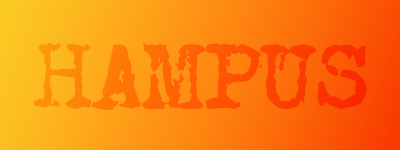

## Hi there, I'm Hampus 🤙
I'm studying webdevelopment with a focus on JS in Gothenburg, Sweden. 
Right now I'm on the lookout for an internship as a developer starting in the fall of 2025. 

Prior to my coding journey I studied Digital Design and spent some years working in Video Production as an Editor / Motion Designer / Colorist. 

# 💻 Tech Stack:
            

<!--
**schwampus/schwampus** is a ✨ _special_ ✨ repository because its `README.md` (this file) appears on your GitHub profile.

# 💫 About Me:
## Hi there, I'm Hampus 🤙 I'm studying webdevelopment with a focus on JS in Gothenburg, Sweden.  Right now I'm on the lookout for an internship as a developer starting in the fall of 2025. 

# 💻 Tech Stack:
               
# 📊 GitHub Stats:
 
 

---

-->
